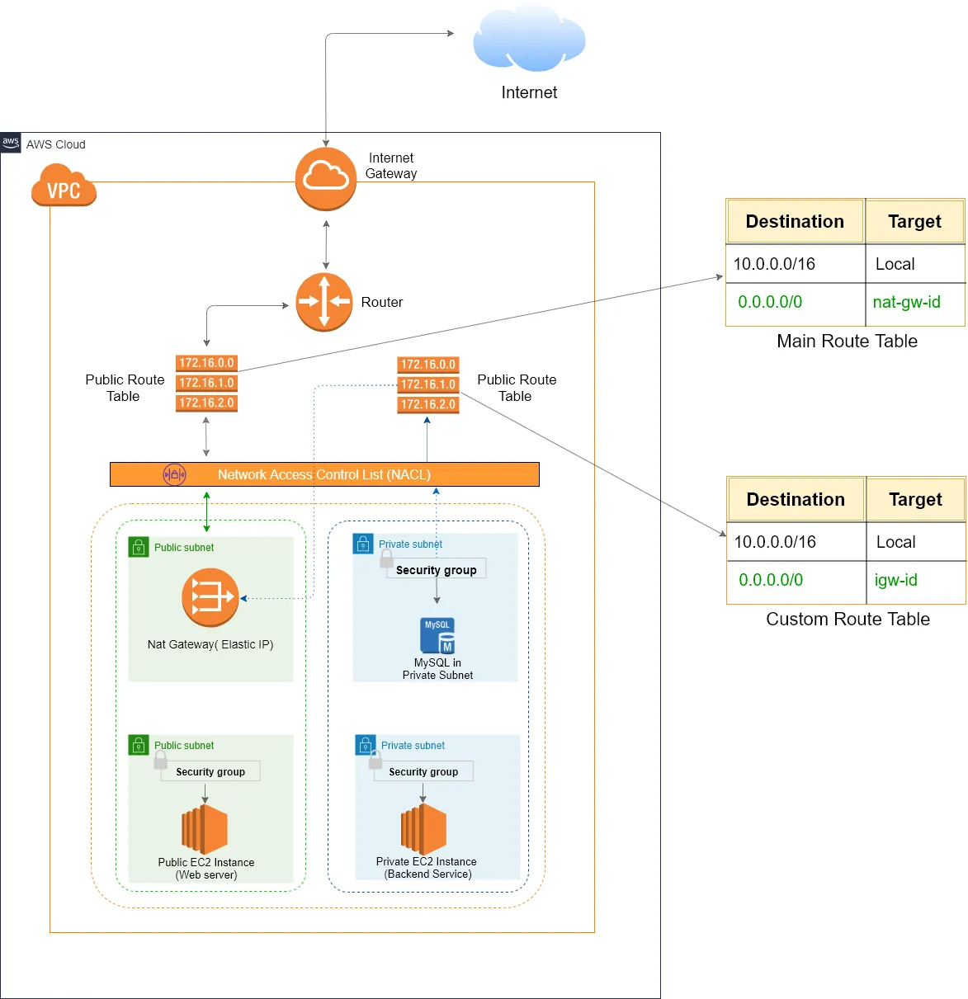

# VPC setup Guide

Welcome to the AWS Vpc setup guide. we will walk through process of creating VPC(Virtual Private Cloud) and its components such as CIDR block, Subnets, Internet gateway, NAT gateway, route tables.

## what is VPC?
A VPC is a logically isolated network inside AWS. It gives full control over Ip addresses range, subneting, routing, firewall rules, internal and external connectivity.

## How to create a VPC
Go to AWS console-> Search VPC
Click on create VPC-> choose CIDR block
VPC will be created.

## Components:
## 1. CIDR Block (IP range)
CIDR block is range of IP addresses of your VPC
For Example, if you choose 10.0.0.0/16 -> it gives 65536 Ips

## 2. Subnets
A subnet is a logical separation inside your VPC, segment of IP ranges 
There are two types of subnets:
1. public
    Public subnet is connected to public internet via Internet Gateway
2. Private 
Private subnet is where you place apps, dbs and no direct connection to internet

Imp: each subnet is must be tied to a specific AZ( Availability Zone)

How to create Subnets:
Navigate to the VPC dashboard.
Click on "Subnets" and then "Create Subnet".
Specify the subnet details including CIDR block and Availability Zone (AZ).

## 3. Internet Gateway
It is a highly available VPC component that enables internet access to instances in public subnet.
 Think of it like: A door between your private VPC and public internet.

To create an Internet Gateway:

    Navigate to the VPC dashboard.
    Click on "Internet Gateways" and then "Create Internet Gateway".
    Attach the Internet Gateway to your VPC.

## Route tables
Define how traffic is routed within the VPC from subnets to other destinations like Internet gateway, NAT or to other networkse. Each subnet is associated with one route table
To create a routing table:

Navigate to the VPC dashboard.
    Click on "Route Tables" and then "Create Route Table".
    Define the routing rules, ensuring that traffic flows efficiently and securely to its intended destination.

## Security Groups
Security groups is a virtusl firewall at instance level. they stateful. It controls the inbound and outbound traffic at the instance level. For example: EC2, RDS instances

- All the traffic is explicitly denies. 
- You can only allow traffic, never explicitly deny
- Outbound traffic is automatically allowed.

## NACLs
Another security firewall but acts at subnet level, they are stateless

## Nate Gateway
Used for resources in private subnets to access the intenet outbound only, while remaining inaccessuble from the outside.

