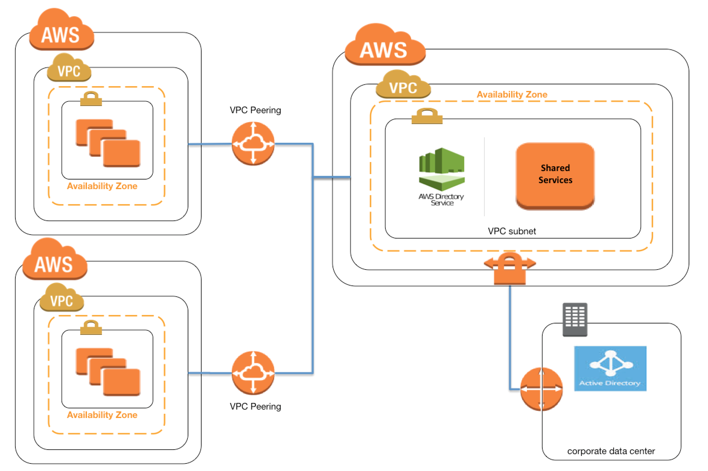

# VPC Peering

## What is VPC Peering?
VPC peering is allows us to connect two VPCs so that they ccan communicate privatley.

## Real-time example

Imagine you working in a company, where data located in two regions, for example, US east and EU regions.
so connect VPCs in two different regions.
or
company using  a shared-services(vpc) hosting RDS database, s3 end point.
you goal is to allow we application in VPC A to access RDS in shared-service vpc securely without using public IPs or internet.

Why Use Peering?
No need to expose RDS to the internet
Reduces cost by avoiding NAT Gateway and data transfer via IGW
Maintains private connectivity between services

With peering connection, we will be eshtablished secure connection between two PVCs for seemless communication.

VPC Peering Setup:
1. Create a VPC connection
    - Requester (VPC A)
    - Accepter (VPC B)
2. Go go VPC A, click peer connection and choose VPC B
3. Accept the Connection
    From VPC B,accept the peering request
4. Adjust Security Groups
    we need allow the secuirty groups for inbound and outbound traffic for all VPCs and instances in side VPCs.

