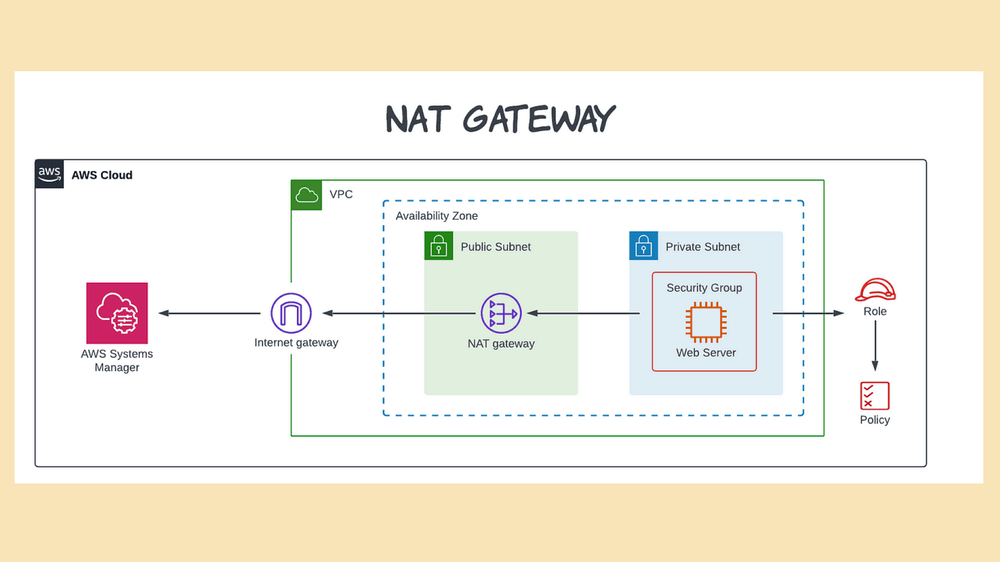

# NAT Gateway

## What is NAT Gateway?
A NAT (Network Address Translatio) Gateway is Aws service that enables a instance in private subnet to access the internet without allowing inbound traffic fron the internet.

## How does it works?
A private instance send request to NAT inorder to access the intenet, NAT gateway then forward traffice to internet or other services, when reponse come back then forwards to the instance in private subnet.

## Practical Example:
suppose you have EC2 instance or RDS in your private subnet, they want to install or update some packages?

By creating NAT gateway in public subnet, routing traffic from private subnet through it, your server can securely eshtablish the connection to internet while inbound traffic is completely restricted.

🔧 How to Create a NAT Gateway (AWS Console)
✅ Prerequisites:
    An Internet Gateway attached to the VPC
    A Public Subnet
    An Elastic IP (EIP) (required for NAT Gateway)

🧭 Step-by-Step:
    Go to VPC → NAT Gateways → Create NAT Gateway
 Choose:
    Subnet: A public subnet
    Elastic IP: Allocate or select one
    Create the NAT Gateway

Then most importantly, update private route table 
        Destination      | Target
    ------------------|----------------------
        0.0.0.0/0         | nat-xxxxxxxxxxxx

🔎 Why do you need an Elastic IP for a NAT Gateway?
Because a NAT Gateway needs a public IP address to send traffic from your private subnet to the internet — and Elastic IP (EIP) is AWS's way of providing a public, static IP.

