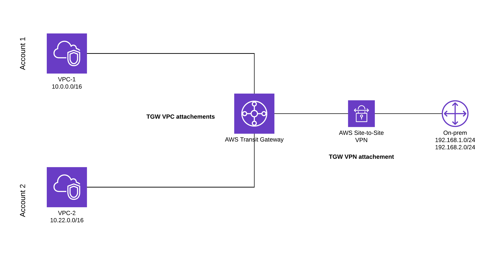

# Transit Gateway

## What is Transit gateway?
A Transit gateway is a central hub that connects multiple VPCs, on-premises networks through singe gaetway.

It acts as central hub for routing traffic between multiple networks. It simplys the newtwork architecture by providing single point of entry and exit, most importantly reducing the complex VPC Peering connection.

Think of it like:
A network router that allows you to connect multiple VPCs without full mesh peering.

## Lets take a scenario:

You have: 
    prod-vpc (10.0.0.0/16)
    dev-vpc (10.1.0.0/16)
    logging-vpc (10.2.0.0/16)
    On-premise datacenter (via VPN)

-> you want to Dev, prod should talk to logging-vpc and On-premise to have access all VPCs

By creating Trasit Gateway, you can attach all VPCs to TGW so that traffic flow happens

🛠️ Setup Summary (AWS Console)
- Go to VPC → Transit Gateways → Create TGW
- Set:
    Name
    ASN (for VPN/BGP)
    Enable DNS support

- Attach VPCs to TGW via VPC attachments
- Configure Transit Gateway route tables

## Benifits of using TGW

**Simplified Network Architecture**: Transit Gateways simplify network connectivity by providing a centralized hub for routing traffic.
**Scalability**: They support the connection of thousands of VPCs and on-premises networks, allowing for scalable network expansion.
**Cost-Effective**: Transit Gateways eliminate the need for multiple VPN connections and complex VPC peering arrangements, reducing operational costs.

## Cost consideration?:
Transit Gateway will be charged based on Per hour + per GB transferred

How do you connect VPCs across different regions?"
To connect VPCs across regions, I use Transit Gateway Peering. I create a Transit Gateway in each region, then create a peering attachment between them.

