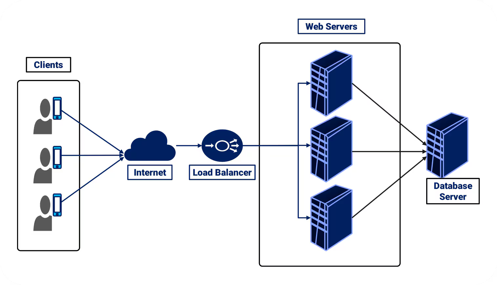

# Load balancing

## What is load balancing?
Load balancing in AWS refers to distributing incoming traffic across multiple resources (like Ec2, pods, containers, Ips) to ensure high availability, falut tolerence, and scalability.
In AWS, this is achieved using the Elastic Load Balancing (ELB) service.

## Types of load balancers
There are 3 types of balancers
1. Application load balancer
2. Network load balancer
3. Gateway load balancer

# Application Load Balancer
ALB is a layer7(HTTP/HTTPS) load balancer in AWS that distribute incoming traffic based on content like URLs, hostnames, query strings, etc.

It’s part of Elastic Load Balancing (ELB) and is best suited for modern web apps, microservices, and containers

## Features:
- Layer 7 (HTTP/HTTPS)- Routes based on content (URLs, headers, etc.)
- Path-based routing-   e.g., /api/* to one target group, /web/* to another
- Host-based routing-   e.g., api.example.com vs admin.example.com
- Target Groups-	      Route traffic to EC2, Lambda, IPs, or ECS containers
- Health Checks-   	 Send traffic only to healthy targets
- SSL Termination--	     Handle HTTPS at ALB, forward plain HTTP to backend

## ⚙️ Real-World Use Case
You're hosting a web app with:
    Frontend served at / from EC2-A
    Backend APIs served at /api from EC2-B

🔁 With ALB:
    / goes to Target Group A
    /api goes to Target Group B

## 📦 ALB Target Types
EC2 Instances
IP Addresses
Lambda Functions
ECS Services (Fargate or EC2)

## Step by step guide to setup ALB:
1. Instance setup
Launch at least 2 EC2 instances in different subnets/AZs
Install a basic web server on each (e.g., Apache or Nginx)

2. 🔹 Step 2: Create a Target Group
- Go to EC2 → Target Groups → Create Target Group

- Choose:
    Target type: EC2 instances
    Protocol: HTTP (or HTTPS)
    Port: 80
    VPC: Select your VPC

- Register your EC2 instances in this target group
- Set Health Check Path (e.g., /)

3. 🔹 Step 3: Create an Application Load Balancer
- Go to EC2 → Load Balancers → Create Load Balancer

- Choose Application Load Balancer

- Set:
    Name: Test-alb
    Scheme: Internet-facing (or internal)
    IP address type: IPv4 or dualstack

- Select 2 or more Availability Zones and subnets

- Configure listeners:
    Add HTTP: port 80
    (Optional) Add HTTPS: port 443 + SSL certificate

🔹 Step 4: Attach Target Group to ALB Listener
Under Listener Rules, forward all traffic to your Target Group

🔹 Step 5: Set Security Groups
- ALB SG: Allow incoming HTTP/HTTPS traffic
- EC2 SG: Allow incoming traffic from ALB SG (not from 0.0.0.0/0)

Test using ALB DNS name from browser

✅ You’re Done!
Now ALB is:
Accepting traffic on HTTP/HTTPS
Distributing it across healthy EC2 instances
Performing health checks and failing over automatically

# NLB (Netwotk Load Balancer)

NLB is a Layer 4 (TCP/UDP) load balancer in AWS that routes traffic based on IP and port, not content.
It’s designed for ultra-low latency, high throughput, and static IP needs.
It's ideal for real-time systems, gaming, streaming or legacy apps."

- Layer 4 Load Balancing:
NLB operates at the transport layer, allowing it to efficiently distribute traffic based on IP protocol data (TCP or UDP).

- High Performance:
NLB offers Millions of requests/sec, high throughput and low latency, making it suitable for latency-sensitive and high-traffic applications.

- Cross-Zone Load Balancing:
NLB supports cross-zone load balancing, enabling it to distribute traffic evenly across instances in different availability zones within the same region.

#  Gateway Load Balancer
AWS Gateway Load Balancer (GWLB) is a Layer 3/4 transparent load balancer designed specifically for deploying, scaling, and managing third-party network appliances — like firewalls, intrusion detection/prevention systems (IDS/IPS), or deep packet inspection (DPI) tools.

🛡️ Real-World Use Case
You want to inspect or filter all incoming/outgoing traffic to/from a VPC.
Instead of routing traffic manually to each firewall EC2, you:

    - Deploy firewall appliances (e.g., Fortinet, Palo Alto, custom EC2)
    - Place them behind a GWLB
    - Route VPC traffic through the GWLB endpoint
    - All traffic is transparently inspected, and scales automatically

