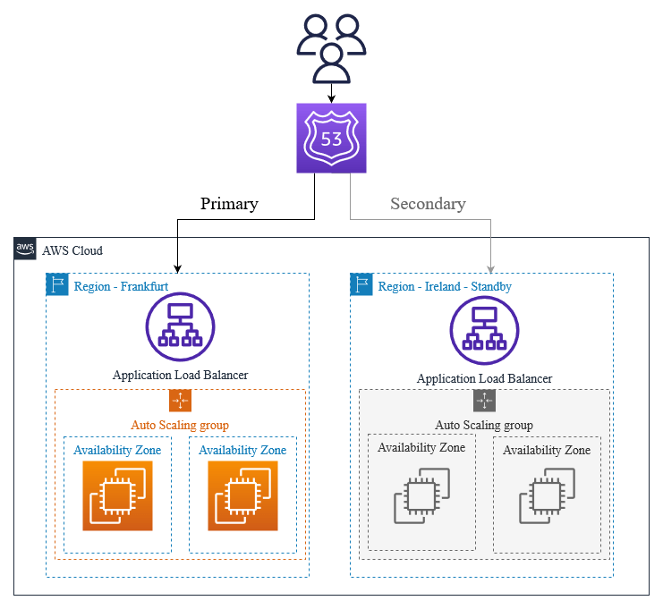

# ROUTE 53

## What is ROUTE 53?
Route 53 is a highly available ans scalable DNS (Domain Name system) web service that allow you to:
- Register Domain Names
- Route internet traffic to AWS resources
- Perform health checks and failover routing

Route 53 will routes end-user traffic to application, servies, or infrastructure based on policies like latency, geo-location, health.

## Functions:

1.DNS Service	
Translates domain names (like example.com) into IP addresses
2. Domain Registration	
Buy and manage domain names directly via AWS
3. Routing Policies	
Control traffic flow with rules like latency or weighted routing
4. Health Checks	
Route traffic away from unhealthy endpoints

## Runting Policies
- Simple	
Single IP or endpoint
- Weighted	
Split traffic based on assigned weights (A/B testing)
- Latency-based	
Route to region with lowest latency
- Failover	
Active-passive setup (redirect if primary fails)
- Geolocation	
Route based on user's country or region

## 📘 Real-Time Use Case
You're hosting a web app in Mumbai (ap-south-1) and Virginia (us-east-1).
Use Route 53 latency-based routing to direct Indian users to Mumbai and US users to Virginia — ensuring lowest latency.

