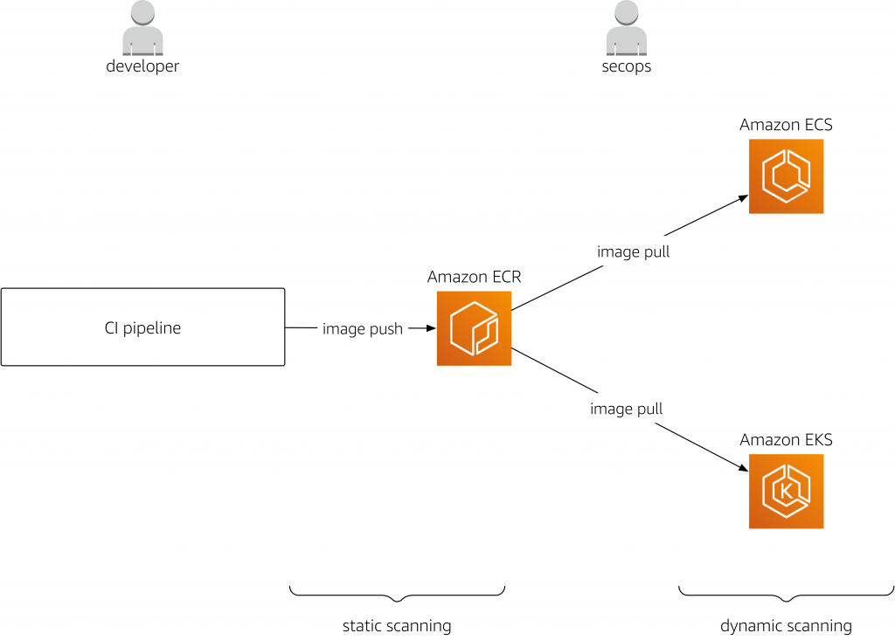

# AWS ECR (Elastic Container Registry)

ECR is container image registry provided by AWS that allow you to store, manage, deploy container images.

In other words, you can store the container images that you build from docker, once you build you can deploy them on to AWS ECR where images stored securely. You can those images to deploy the applications to EKS, ECS, Fargate, Lambda. 

## 🛠️ How ECR Works in a Typical Flow
- Build Docker image locally or in CI/CD (e.g., CodeBuild)

- Tag the image with your ECR repository URL

- Push the image to ECR

- Pull the image from ECR in ECS/EKS to deploy

-- You need to authenticate Docker with ECR inorder to push the docker images to ECR

```bash
aws ecr get-login-password --region ap-south-1 | docker login --username AWS --password-stdin <account>.dkr.ecr.ap-south-1.amazonaws.com
```
- Fully Managed repo, you can have both private and public repos
- You can integrate with CI/CD like Jenkins, GitHub actions to automate the image push.


