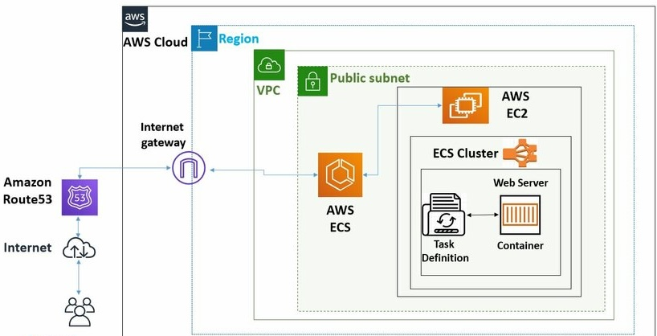

#  ECS (Elastic Container Service)

ECS is a fully managed container orchestration that makes it easy to deploy manage, and scale containernerized applications. It runs docker contaniers on AWS without needing to manage your own Kubenetes.

But ECS is restircted to only AWS

ECS is a good container orchestration platform but doesn't have all the capabilities such as k8s

- very simple in nature, k8s is complex architecture
- It supports EC2, Fargate

Most organizations used EKS or self managed k8s on EC2

## Components in ECS

1.Task Definition
Blueprint of your app (container config, CPU, memory, ports)
2. Task	
A running instance of a Task Definition
3. Service	
Manages long-running tasks and keeps the desired count running
4. Cluster	
Logical group of EC2 or Fargate infrastructure
5. Launch Type	
EC2 (you manage VMs) or Fargate (serverless)
6. Container Agent	
Installed on EC2 to manage communication with ECS

